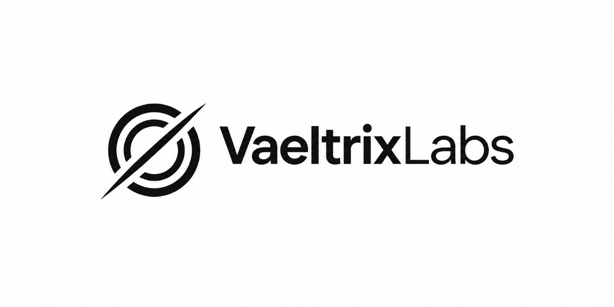
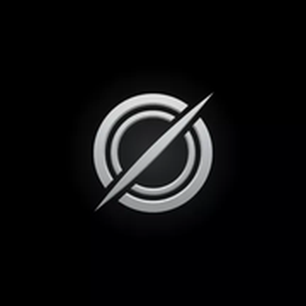

<!-- ====================== LOGO ====================== -->

  

 

  
  
  

---

## Tentang VaeltrixLabs

Ada satu pertanyaan yang selalu menggelitik kami sejak awal:

> **Mengapa AI yang bagus selalu terasa jauh?**

Jauh dari perangkat low-end.  
Jauh dari bandwidth terbatas.  
Jauh dari orang yang tidak punya akses ke hardware mahal.

VaeltrixLabs lahir dari kegelisahan itu.

Kami percaya bahwa kecerdasan buatan seharusnya menjadi **hak**, bukan privilege.  
Kami percaya bahwa AI yang kuat tidak harus berat.  
Kami percaya bahwa masa depan AI tidak boleh hanya ditentukan oleh segelintir perusahaan besar.

Oleh karena itu, VaeltrixLabs berdiri.

Kami bukan sekadar membuat chatbot.  
Kami sedang membangun **fondasi**.

---

## Perjalanan Kami Saat Ini

Saat ini, produk utama kami adalah **VaeltrixAI** — sebuah AI assistant modern yang dibangun dengan teknologi terkini dan dirancang agar ringan, cepat, serta bisa dijalankan di hampir semua perangkat.

**Coba langsung:** [https://vaeltrix-ai.vercel.app](https://vaeltrix-ai.vercel.app)

Namun itu hanyalah langkah pertama.

Kami sedang berada di tahap yang jauh lebih penting:

### **Riset & Pengembangan Model Sendiri**

Tim VaeltrixLabs sedang secara aktif membahas dan merancang arah untuk melatih model foundation kami sendiri.  
Ini masih dalam tahap riset mendalam — penuh diskusi, eksperimen, dan perencanaan jangka panjang.

Kami tidak terburu-buru.  
Karena membangun model sendiri bukan sekadar soal teknis, melainkan soal tanggung jawab, arah, dan nilai yang ingin kami tanamkan.

Kami ingin suatu hari nanti VaeltrixAI tidak hanya “menggunakan” model,  
melainkan **menjadi** model itu sendiri.

---

## Safety & Tanggung Jawab

VaeltrixAI dibangun dengan prinsip keselamatan yang ketat.

Kami menerapkan pendekatan **Safety Constitutional AI**, dilengkapi dengan **UUD AI** (kerangka nilai internal kami), Terms of Service, serta berbagai kebijakan keselamatan lainnya. Tujuannya satu: agar VaeltrixAI dapat digunakan secara aman, bertanggung jawab, dan bermanfaat.

Kami percaya bahwa kekuatan AI harus selalu diimbangi dengan tanggung jawab yang setara.

### Penggunaan Data

Data dan pesan yang dikirimkan ke VaeltrixAI dapat digunakan untuk membantu proses pelatihan dan peningkatan model Vaeltrix di masa depan.  
Kami melakukan ini dengan penuh kesadaran akan pentingnya privasi dan keamanan data pengguna.

Kami berkomitmen untuk terus menyempurnakan praktik ini seiring berkembangnya model kami sendiri.

---

## Apa yang Kami Yakini

**1. AI harus ringan**  
Kecerdasan tidak boleh hanya milik perangkat flagship. Setiap orang berhak merasakan manfaat AI tanpa harus menunggu hardware generasi berikutnya.

**2. Independensi itu penting**  
Bergantung sepenuhnya pada pihak ketiga membuat kita rentan. Oleh karena itu kami memutuskan untuk mulai berjalan menuju model proprietary milik sendiri.

**3. Privasi & Safety adalah fondasi**  
Data pengguna adalah milik pengguna. Keselamatan penggunaan adalah prioritas.

**4. Kecepatan + keindahan bisa berjalan beriringan**  
Kami menolak kompromi antara performa dan pengalaman pengguna.

**5. Proses lebih penting daripada hype**  
Kami lebih memilih bergerak pelan tapi dalam, daripada cepat tapi dangkal.

---

## VaeltrixAI — Produk Saat Ini

VaeltrixAI adalah bukti nyata dari filosofi kami:

- Dibangun dengan **Next.js, React, TypeScript, dan Tailwind CSS**
- Mendukung **Vue.js** untuk fleksibilitas pengembangan
- Authentication modern: Login dengan **GitHub, Google, dan Email**
- Database menggunakan **Firebase**
- Progressive Web App (bisa diinstall ke homescreen)
- Dilengkapi sistem memory, persona, attachment, project workspace, dan voice
- Dilatih dengan prinsip **Safety Constitutional AI** + **UUD AI**

> Status: **Closed Source**  
> Kami memilih jalur proprietary karena sedang menyiapkan fondasi yang lebih besar di masa depan.

**Live Demo →** [https://vaeltrix-ai.vercel.app](https://vaeltrix-ai.vercel.app)

---

## Tech Stack & Skills

### Frontend

### Authentication

### Backend & Database

### AI & Research Direction

### Development & Infrastructure

---

## Arah yang Sedang Kami Tempuh

| Tahap                        | Status              | Keterangan                                      |
|-----------------------------|---------------------|-------------------------------------------------|
| VaeltrixAI (Aplikasi)       | Aktif               | Continuous improvement                          |
| Frontend Modern             | Selesai             | Next.js + React + TypeScript + Tailwind         |
| Authentication              | Selesai             | GitHub, Google, Email                           |
| Database                    | Selesai             | Firebase                                        |
| Riset Model Sendiri         | Sedang Berjalan     | Diskusi & perencanaan mendalam bersama tim      |
| Training Pipeline           | Riset               | Masih dalam tahap eksplorasi                    |
| Foundation Model            | Visi Jangka Panjang | Tujuan utama kami                               |
| Safety & Alignment          | Prioritas Tinggi    | Constitutional AI + UUD AI                      |

Kami tidak menjanjikan keajaiban dalam semalam.  
Kami menjanjikan **konsistensi**.

---

## Tim di Balik VaeltrixLabs

**RajaCoders**  
Founder & Lead  
Pembuat VaeltrixAI  
Pemimpin visi VaeltrixLabs

Didukung oleh tim kecil yang percaya bahwa AI yang bermakna hanya bisa lahir dari niat yang tulus dan kerja yang dalam.

---

## Mari Berkenalan

Kami selalu terbuka untuk diskusi, kolaborasi, atau sekadar saling menyapa.

&nbsp;

&nbsp;

&nbsp;

&nbsp;

&nbsp;

&nbsp;

&nbsp;

  

  

---

 

### Penutup

Kami tidak sedang mengejar tren.  
Kami sedang membangun sesuatu yang kami yakini akan bertahan.

Jika suatu hari nanti Anda merasakan AI yang terasa lebih dekat, lebih ringan, dan lebih “milik sendiri” —  
semoga itu adalah buah dari perjalanan yang sedang kami tempuh hari ini.

 

**VaeltrixLabs**  
*Built with intention. Powered by RajaCoders.*

 

  

© 2026 VaeltrixLabs. All rights reserved.

